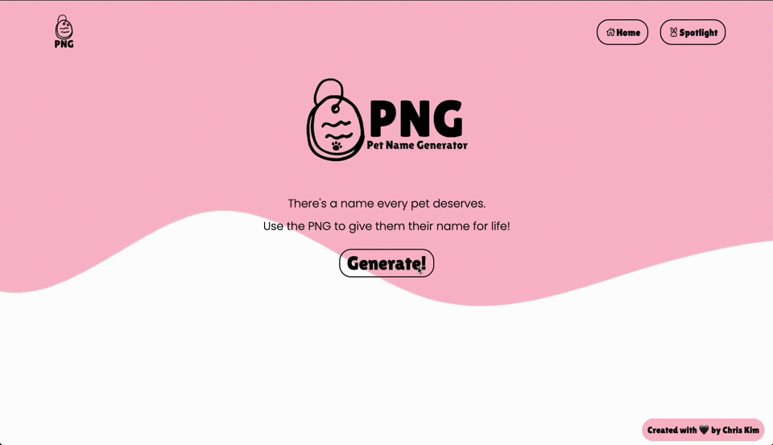

# PNG: Pet Name Generator🐾!

<a href="">🔗Live Link</a>

# About

<a href=""> PNG</a> is a single-page React application that generates pet names per TYPE and PERSONALITY of your pet.

This mini-project was completed in January 2023 after discovering <a href="https://docs.cohere.ai/">co:here's Language AI products and playground</a>. Through this project, I explored the <a href="https://docs.cohere.ai/reference/generate">Co.Generate API</a>, specifically - which this project is graciously powered by - as well as brushed up my React skills!

# Project Demo

Additional features including the 'Spotlight' page where users will be able to save their generated pet names and view others' PNG'd names will be available soon, as well as an addition of some advanced error handling for the APIs. 

<h3 align="center">✨ Stay tuned ✨</h3>
